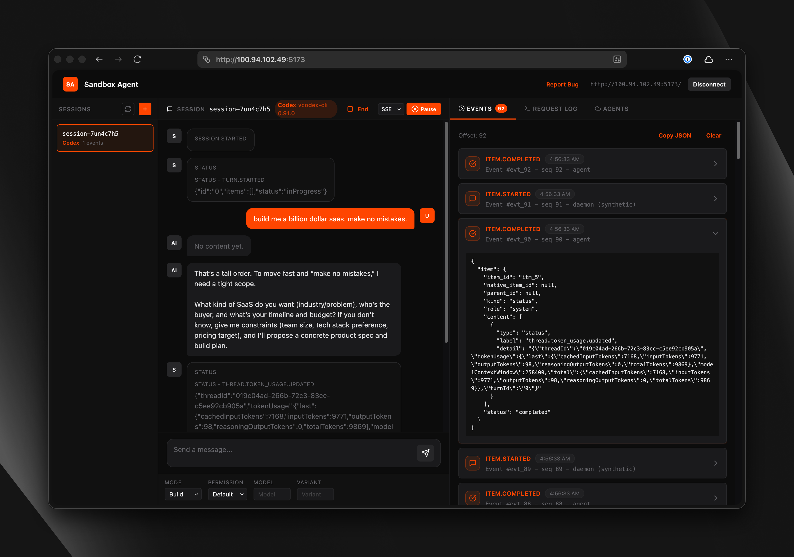

<p align="center">
  
</p>

<h3 align="center">Run Coding Agents in Sandboxes. Control Them Over HTTP.</h3>

<p align="center">
  A server that runs inside your sandbox. Your app connects remotely to control Claude Code, Codex, OpenCode, or Amp — streaming events, handling permissions, managing sessions.
</p>

<p align="center">
  <a href="https://sandboxagent.dev/docs">Documentation</a> — <a href="https://sandboxagent.dev/docs/api-reference">API Reference</a> — <a href="https://rivet.dev/discord">Discord</a>
</p>

<p align="center">
  <em><strong>Experimental:</strong> <a href="./gigacode/">Gigacode</a> — use OpenCode's TUI with any coding agent.</em>
</p>

## Why Sandbox Agent?

Running coding agents remotely is hard. Existing SDKs assume local execution, SSH breaks TTY handling and streaming, and every agent has a different API. Building from scratch means reimplementing everything for each coding agent.

Sandbox Agent solves three problems:

1. **Coding agents need sandboxes** — You can't let AI execute arbitrary code on your production servers. Coding agents need isolated environments, but existing SDKs assume local execution. Sandbox Agent is a server that runs inside the sandbox and exposes HTTP/SSE.

2. **Every coding agent is different** — Claude Code, Codex, OpenCode, and Amp each have proprietary APIs, event formats, and behaviors. Swapping agents means rewriting your integration. Sandbox Agent provides one HTTP API — write your code once, swap agents with a config change.

3. **Sessions are ephemeral** — Agent transcripts live in the sandbox. When the process ends, you lose everything. Sandbox Agent streams events in a universal schema to your storage. Persist to Postgres, ClickHouse, or [Rivet](https://rivet.dev). Replay later, audit everything.

## Features

- **Universal Agent API**: Single interface to control Claude Code, Codex, OpenCode, and Amp with full feature coverage
- **Streaming Events**: Real-time SSE stream of everything the agent does — tool calls, permission requests, file edits, and more
- **Universal Session Schema**: [Standardized schema](https://sandboxagent.dev/docs/session-transcript-schema) that normalizes all agent event formats for storage and replay
- **Human-in-the-Loop**: Approve or deny tool executions and answer agent questions remotely over HTTP
- **Automatic Agent Installation**: Agents are installed on-demand when first used — no setup required
- **Runs Inside Any Sandbox**: Lightweight static Rust binary. One curl command to install inside E2B, Daytona, Vercel Sandboxes, or Docker
- **Server or SDK Mode**: Run as an HTTP server or embed with the TypeScript SDK
- **OpenAPI Spec**: [Well documented](https://sandboxagent.dev/docs/api-reference) and easy to integrate from any language
- **OpenCode SDK & UI Support** *(Experimental)*: [Connect OpenCode CLI, SDK, or web UI](https://sandboxagent.dev/docs/opencode-compatibility) to control agents through familiar OpenCode tooling

## Architecture


The Sandbox Agent acts as a universal adapter between your client application and various coding agents. Each agent has its own adapter that handles the translation between the universal API and the agent-specific interface.

- **Embedded Mode**: Runs agents locally as subprocesses
- **Server Mode**: Runs as HTTP server from any sandbox provider

[Architecture documentation](https://sandboxagent.dev/docs)

## Components

| Component | Description |
|-----------|-------------|
| **Server** | Rust daemon (`sandbox-agent server`) exposing the HTTP + SSE API |
| **SDK** | TypeScript client with embedded and server modes |
| **Inspector** | Built-in UI at inspecting sessions and events |
| **CLI** | `sandbox-agent` (same binary, plus npm wrapper) mirrors the HTTP endpoints |

## Get Started

Choose the installation method that works best for your use case.

### Skill

Install skill with:

```bash
npx skills add rivet-dev/skills -s sandbox-agent
```

```bash
bunx skills add rivet-dev/skills -s sandbox-agent
```

### TypeScript SDK

Import the SDK directly into your Node or browser application. Full type safety and streaming support.

**Install**

```bash
npm install sandbox-agent
```

```bash
bun add sandbox-agent
# Optional: allow Bun to run postinstall scripts for native binaries (required for SandboxAgent.start()).
bun pm trust @sandbox-agent/cli-linux-x64 @sandbox-agent/cli-darwin-arm64 @sandbox-agent/cli-darwin-x64 @sandbox-agent/cli-win32-x64
```

**Setup**

Local (embedded mode):

```ts
import { SandboxAgent } from "sandbox-agent";

const client = await SandboxAgent.start();
```

Remote (server mode):

```ts
import { SandboxAgent } from "sandbox-agent";

const client = await SandboxAgent.connect({
  baseUrl: "http://127.0.0.1:2468",
  token: process.env.SANDBOX_TOKEN,
});
```

**API Overview**

```ts
const agents = await client.listAgents();

await client.createSession("demo", {
  agent: "codex",
  agentMode: "default",
  permissionMode: "plan",
});

await client.postMessage("demo", { message: "Hello from the SDK." });

for await (const event of client.streamEvents("demo", { offset: 0 })) {
  console.log(event.type, event.data);
}
```

[SDK documentation](https://sandboxagent.dev/docs/sdks/typescript) — [Building a Chat UI](https://sandboxagent.dev/docs/building-chat-ui) — [Managing Sessions](https://sandboxagent.dev/docs/manage-sessions)

### HTTP Server

Run as an HTTP server and connect from any language. Deploy to E2B, Daytona, Vercel, or your own infrastructure.

```bash
# Install it
curl -fsSL https://releases.rivet.dev/sandbox-agent/latest/install.sh | sh
# Run it
sandbox-agent server --token "$SANDBOX_TOKEN" --host 127.0.0.1 --port 2468
```

Optional: preinstall agent binaries (no server required; they will be installed lazily on first use if you skip this):

```bash
sandbox-agent install-agent claude
sandbox-agent install-agent codex
sandbox-agent install-agent opencode
sandbox-agent install-agent amp
```

To disable auth locally:

```bash
sandbox-agent server --no-token --host 127.0.0.1 --port 2468
```

[Quickstart](https://sandboxagent.dev/docs/quickstart) — [Deployment guides](https://sandboxagent.dev/docs/deploy)

### CLI

Install the CLI wrapper (optional but convenient):

```bash
npm install -g @sandbox-agent/cli
```

```bash
# Allow Bun to run postinstall scripts for native binaries.
bun add -g @sandbox-agent/cli
bun pm -g trust @sandbox-agent/cli-linux-x64 @sandbox-agent/cli-darwin-arm64 @sandbox-agent/cli-darwin-x64 @sandbox-agent/cli-win32-x64
```

Create a session and send a message:

```bash
sandbox-agent api sessions create my-session --agent codex --endpoint http://127.0.0.1:2468 --token "$SANDBOX_TOKEN"
sandbox-agent api sessions send-message my-session --message "Hello" --endpoint http://127.0.0.1:2468 --token "$SANDBOX_TOKEN"
sandbox-agent api sessions send-message-stream my-session --message "Hello" --endpoint http://127.0.0.1:2468 --token "$SANDBOX_TOKEN"
```

You can also use npx like:

```bash
npx sandbox-agent --help
```

```bash
bunx sandbox-agent --help
```

[CLI documentation](https://sandboxagent.dev/docs/cli)

### Inspector

Debug sessions and events with the built-in Inspector UI (e.g., `http://localhost:2468/ui/`).



[Inspector documentation](https://sandboxagent.dev/docs/inspector)

### OpenAPI Specification

[Explore API](https://sandboxagent.dev/docs/api-reference) — [View Specification](https://github.com/rivet-dev/sandbox-agent/blob/main/docs/openapi.json)

### Session Transcript Schema

All events follow a [session transcript schema](https://sandboxagent.dev/docs/session-transcript-schema) that normalizes differences between agents.

### Tip: Extract credentials

Often you need to use your personal API tokens to test agents on sandboxes:

```bash
sandbox-agent credentials extract-env --export
```

This prints environment variables for your OpenAI/Anthropic/etc API keys to test with Sandbox Agent SDK.

## FAQ

<details>
<summary><strong>Does this replace the Vercel AI SDK?</strong></summary>

No, they're complementary. AI SDK is for building chat interfaces and calling LLMs. This SDK is for controlling autonomous coding agents that write code and run commands. Use AI SDK for your UI, use this when you need an agent to actually code.
</details>

<details>
<summary><strong>Which coding agents are supported?</strong></summary>

Claude Code, Codex, OpenCode, and Amp. The SDK normalizes their APIs so you can swap between them without changing your code.
</details>

<details>
<summary><strong>How is session data persisted?</strong></summary>

This SDK does not handle persisting session data. Events stream in a universal JSON schema that you can persist anywhere. See [Managing Sessions](https://sandboxagent.dev/docs/manage-sessions) for patterns using Postgres or [Rivet Actors](https://rivet.dev).
</details>

<details>
<summary><strong>Can I run this locally or does it require a sandbox provider?</strong></summary>

Both. Run locally for development, deploy to E2B, Daytona, or Vercel Sandboxes for production.
</details>

<details>
<summary><strong>Does it support [platform]?</strong></summary>

The server is a single Rust binary that runs anywhere with a curl install. If your platform can run Linux binaries (Docker, VMs, etc.), it works. See the deployment guides for E2B, Daytona, and Vercel Sandboxes.
</details>

<details>
<summary><strong>Can I use this with my personal API keys?</strong></summary>

Yes. Use `sandbox-agent credentials extract-env` to extract API keys from your local agent configs (Claude Code, Codex, OpenCode, Amp) and pass them to the sandbox environment.
</details>

<details>
<summary><strong>Why Rust and not [language]?</strong></summary>

Rust gives us a single static binary, fast startup, and predictable memory usage. That makes it easy to run inside sandboxes or in CI without shipping a large runtime, such as Node.js.
</details>

<details>
<summary><strong>Why can't I just run coding agents locally?</strong></summary>

You can for development. But in production, you need isolation. Coding agents execute arbitrary code — that can't happen on your servers. Sandboxes provide the isolation; this SDK provides the HTTP API to control coding agents remotely.
</details>

<details>
<summary><strong>How is this different from the agent's official SDK?</strong></summary>

Official SDKs assume local execution. They spawn processes and expect interactive terminals. This SDK runs a server inside a sandbox that you connect to over HTTP — designed for remote control from the start.
</details>

<details>
<summary><strong>Why not just SSH into the sandbox?</strong></summary>

Coding agents expect interactive terminals with proper TTY handling. SSH with piped commands breaks tool confirmations, streaming output, and human-in-the-loop flows. The SDK handles all of this over a clean HTTP API.
</details>

## Out of Scope

- **Storage of sessions on disk**: Sessions are already stored by the respective coding agents on disk. It's assumed that the consumer is streaming data from this machine to an external storage, such as Postgres, ClickHouse, or Rivet.
- **Direct LLM wrappers**: Use the [Vercel AI SDK](https://ai-sdk.dev/docs/introduction) if you want to implement your own agent from scratch.
- **Git Repo Management**: Just use git commands or the features provided by your sandbox provider of choice.
- **Sandbox Provider API**: Sandbox providers have many nuanced differences in their API, it does not make sense for us to try to provide a custom layer. Instead, we opt to provide guides that let you integrate this project with sandbox providers.

## Roadmap

- [ ] Python SDK
- [ ] Automatic MCP & skill & hook configuration
- [ ] Todo lists
