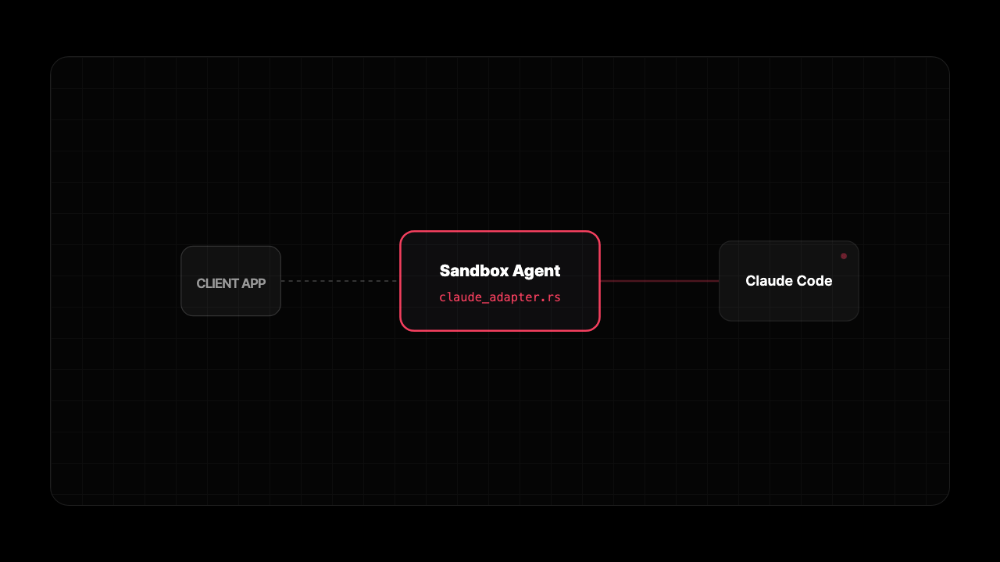

# Sandbox Agent SDK

Universal API for automatic coding agents in sandboxes. Supports Claude Code, Codex, OpenCode, and Amp.

Docs: https://rivet.dev/docs/

- **Any coding agent**: Universal API to interact with all agents with full feature coverage
- **Server or SDK mode**: Run as an HTTP server or with the TypeScript SDK
- **Universal session schema**: Universal schema to store agent transcripts
- **Supports your sandbox provider**: Daytona, E2B, Vercel Sandboxes, and more
- **Lightweight, portable Rust binary**: Install anywhere with 1 curl command
- **OpenAPI spec**: https://rivet.dev/docs/api

Roadmap:

- [ ] Python SDK
- [ ] Automatic MCP & skill & hook configuration
- [ ] Todo lists
- [ ] Session diff
- [ ] Subagents

## Agent Compatibility

| Feature | [Claude Code*](https://docs.anthropic.com/en/docs/agents-and-tools/claude-code/overview) | [Codex](https://github.com/openai/codex) | [OpenCode](https://github.com/opencode-ai/opencode) | [Amp](https://ampcode.com) |
|---------|:-----------:|:-----:|:--------:|:---:|
| Stability | Stable | Stable | Experimental | Experimental |
| Text Messages | ✓ | ✓ | ✓ | ✓ |
| Tool Calls | —* | ✓ | ✓ | ✓ |
| Tool Results | —* | ✓ | ✓ | ✓ |
| Questions (HITL) | —* | | ✓ | |
| Permissions (HITL) | —* | | ✓ | |
| Images | | ✓ | ✓ | |
| File Attachments | | ✓ | ✓ | |
| Session Lifecycle | | ✓ | ✓ | |
| Error Events | | ✓ | ✓ | ✓ |
| Reasoning/Thinking | | ✓ | | |
| Command Execution | | ✓ | | |
| File Changes | | ✓ | | |
| MCP Tools | | ✓ | | |
| Streaming Deltas | | ✓ | ✓ | |

* Claude headless CLI does not natively support tool calls/results or HITL questions/permissions yet; these are WIP.

Want support for another agent? [Open an issue](https://github.com/anthropics/sandbox-agent/issues/new) to request it.

## Architecture



The Sandbox Agent acts as a universal adapter between your client application and various coding agents (Claude Code, Codex, OpenCode, Amp). Each agent has its own adapter (e.g., `claude_adapter.rs`) that handles the translation between the universal API and the agent-specific interface.

- **Embedded Mode**: Runs agents locally as subprocesses
- **Server Mode**: Runs as HTTP server from any sandbox provider

See https://rivet.dev/docs/architecture for a deeper walkthrough.

## Components

- Server: Rust daemon (`sandbox-agent server`) exposing the HTTP + SSE API.
- SDK: TypeScript client with embedded and server modes.
- Inspector: `https://inspect.sandboxagent.dev` for browsing sessions and events.
- CLI: `sandbox-agent` (same binary, plus npm wrapper) mirrors the HTTP endpoints.

## Quickstart

### Skill

Install skill with:

```
npx skills add https://sandboxagent.dev/docs
```

### SDK

**Install**

```bash
npm install sandbox-agent
```

**Setup**

Local (embedded mode):

```ts
import { SandboxAgent } from "sandbox-agent";

const client = await SandboxAgent.start();
```

Remote (server mode):

```ts
import { SandboxAgent } from "sandbox-agent";

const client = await SandboxAgent.connect({
  baseUrl: "http://127.0.0.1:2468",
  token: process.env.SANDBOX_TOKEN,
});
```

**API Overview**

```ts
const agents = await client.listAgents();

await client.createSession("demo", {
  agent: "codex",
  agentMode: "default",
  permissionMode: "plan",
});

await client.postMessage("demo", { message: "Hello from the SDK." });

for await (const event of client.streamEvents("demo", { offset: 0 })) {
  console.log(event.type, event.data);
}
```

Full guide: https://rivet.dev/docs/sdks/typescript

### Server

Install the binary (fastest installation, no Node.js required):

```bash
# Install it
curl -fsSL https://releases.rivet.dev/sandbox-agent/latest/install.sh | sh
# Run it
sandbox-agent server --token "$SANDBOX_TOKEN" --host 127.0.0.1 --port 2468
```

To disable auth locally:

```bash
sandbox-agent server --no-token --host 127.0.0.1 --port 2468
```

Docs: https://rivet.dev/docs/quickstart
Integration guides: https://rivet.dev/docs/deployments

### CLI

Install the CLI wrapper (optional but convenient):

```bash
npm install -g @sandbox-agent/cli
```

Create a session and send a message:

```bash
sandbox-agent sessions create my-session --agent codex --endpoint http://127.0.0.1:2468 --token "$SANDBOX_TOKEN"
sandbox-agent sessions send-message my-session --message "Hello" --endpoint http://127.0.0.1:2468 --token "$SANDBOX_TOKEN"
sandbox-agent sessions send-message-stream my-session --message "Hello" --endpoint http://127.0.0.1:2468 --token "$SANDBOX_TOKEN"
```

Docs: https://rivet.dev/docs/cli

### Extract credentials

```bash
sandbox-agent credentials extract-env --export
```

This prints environment variables for your locally installed agents.
Docs: https://rivet.dev/docs/quickstart

## Project Goals

This project aims to solve 3 problems with agents:

- **Universal Agent API**: Claude Code, Codex, Amp, and OpenCode all have put a lot of work in to the agent scaffold. Each have respective pros and cons and need to be easy to be swapped between.
- **Agent Transcript**: Maintaining agent transcripts is difficult since the agent manages its own sessions. This provides a simpler way to read and retrieve agent transcripts in your system.
- **Agents In Sandboxes**: There are many complications with running agents inside of sandbox providers. This lets you run a simple curl command to spawn an HTTP server for using any agent from within the sandbox.

Features out of scope:

- **Storage of sessions on disk**: Sessions are already stored by the respective coding agents on disk. It's assumed that the consumer is streaming data from this machine to an external storage, such as Postgres, ClickHouse, or Rivet.
- **Direct LLM wrappers**: Use the [Vercel AI SDK](https://ai-sdk.dev/docs/introduction) if you want to implement your own agent from scratch.
- **Git Repo Management**: Just use git commands or the features provided by your sandbox provider of choice.
- **Sandbox Provider API**: Sandbox providers have many nuanced differences in their API, it does not make sense for us to try to provide a custom layer. Instead, we opt to provide guides that let you integrate this project with sandbox providers.

## FAQ

**Why not use PTY?**

PTY-based approaches require parsing terminal escape sequences and dealing with interactive prompts.

The agents we support all have machine-readable output modes (JSONL, HTTP APIs) that provide structured events, making integration more reliable.

**Why not use features that already exist on sandbox provider APIs?**

Sandbox providers focus on infrastructure (containers, VMs, networking).

This project focuses specifically on coding agent orchestration: session management, HITL (human-in-the-loop) flows, and universal event schemas. These concerns are complementary.

**Does it support [platform]?**
The server is a single Rust binary that runs anywhere with a curl install. If your platform can run Linux binaries (Docker, VMs, etc.), it works. See the deployment guides for E2B, Daytona, Vercel Sandboxes, and Docker.

**Can I use this with my personal API keys?**
Yes. Use `sandbox-agent credentials extract-env` to extract API keys from your local agent configs (Claude Code, Codex, OpenCode, Amp) and pass them to the sandbox environment.

**Why Rust?**
Rust gives us a single static binary, fast startup, and predictable memory usage. That makes it
easy to run inside sandboxes or in CI without shipping a large runtime.

**Why not use stdio/JSON-RPC?**

- has benefit of not having to listen on a port
- more difficult to interact with, harder to analyze, doesn't support inspector for debugging
- may add at some point
- Codex does this and Claude has a JSON stream, but HTTP/SSE gives us a consistent API surface and inspector UI.

**Why not AI SDK?**

- AI SDK does not provide harness for bieng a fully fledged coding agent
- Fronteir coding agent harnesses have a lot of work put in to complex things like swarms, compaction, etc

**Why not OpenCode server?**

- The harnesses do a lot of heavy lifting, but different agents have very different APIs and behavior.
- A universal API lets you swap agents without rewriting your orchestration code.
