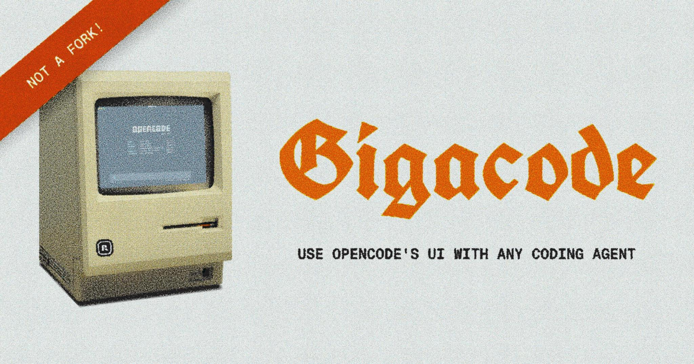

<p align="center">
  
</p>

<h3 align="center">Supports Claude Code, Codex, and Amp.</h3>

<p align="center">
    <i>This is <u>not</u> a fork (and never will be).<br/>It's powered by <a href="https://sandboxagent.dev">Sandbox Agent SDK</a>'s wizardry.<br/>Experimental & just for fun.</i>
</p>

<p align="center">
    <a href="https://github.com/rivet-dev/sandbox-agent/issues">Issues</a> — <a href="https://rivet.dev/discord">Discord</a> — <a href="https://sandboxagent.dev/docs/opencode-compatibility#endpoint-coverage">Supported OpenCode Features</a>
</p>


## How It Works

```
┌─ Gigacode ────────────────────────────────────────────────────────┐
│ ┌─────────────────┐    ┌─────────────────┐    ┌─────────────────┐ │
│ │  OpenCode TUI   │───▶│  Sandbox Agent  │───▶│  Claude Code /  │ │
│ │                 │    │                 │    │   Codex / Amp   │ │
│ └─────────────────┘    └─────────────────┘    └─────────────────┘ │
└───────────────────────────────────────────────────────────────────┘
```

- [Sandbox Agent SDK](https://sandboxagent.dev) provides a universal HTTP API for controlling Claude Code, Codex, and Amp
- Sandbox Agent SDK exposes an [OpenCode-compatible endpoint](https://sandboxagent.dev/docs/opencode-compatibility) so OpenCode can talk to any agent
- OpenCode connects to Sandbox Agent SDK via [`attach`](https://opencode.ai/docs/cli/#attach)

## OpenCode Models vs Gigacode Agents

- **OpenCode** supports **switching between inference providers** (Anthropic, OpenAI, etc.). This is OpenCode talking directly to the models with its own tools, system prompts, and agentic loop.
- **Gigacode** automates other coding agent harnesses, so it's using the **exact same logic that you would if you ran Claude Code**, Codex, or Amp natively.

```
OpenCode (native):   Model → OpenCode's tool loop → result
Gigacode:            Model → Claude Code / Codex / Amp CLI → result
```

This means you get each agent's specialized capabilities (such as Claude Code's `Read`/`Write`/`Bash` tools, Codex's sandboxed execution, and Amp's permission rules) rather than a single tool loop with different models behind it.

## Install

**macOS / Linux / WSL (Recommended)**

```bash
curl -fsSL https://releases.rivet.dev/sandbox-agent/latest/gigacode-install.sh | sh
```

**npm i -g**

```bash
npm install -g @sandbox-agent/gigacode
gigacode --help
```

**bun add -g**

```bash
bun add -g @sandbox-agent/gigacode
# Allow Bun to run postinstall scripts for native binaries.
bun pm -g trust @sandbox-agent/gigacode-linux-x64 @sandbox-agent/gigacode-linux-arm64 @sandbox-agent/gigacode-darwin-arm64 @sandbox-agent/gigacode-darwin-x64 @sandbox-agent/gigacode-win32-x64
gigacode --help
```

**npx**

```bash
npx @sandbox-agent/gigacode --help
```

**bunx**

```bash
bunx @sandbox-agent/gigacode --help
```

> **Note:** Windows is unsupported. Please use [WSL](https://learn.microsoft.com/en-us/windows/wsl/install).

## Usage

**TUI**

Launch the OpenCode TUI with any coding agent:

```bash
gigacode
```

**Web UI**

Use the [OpenCode Web UI](https://sandboxagent.dev/docs/opencode-compatibility) to control any coding agent from the browser.

**OpenCode SDK**

Use the [`@opencode-ai/sdk`](https://sandboxagent.dev/docs/opencode-compatibility) to programmatically control any coding agent.
